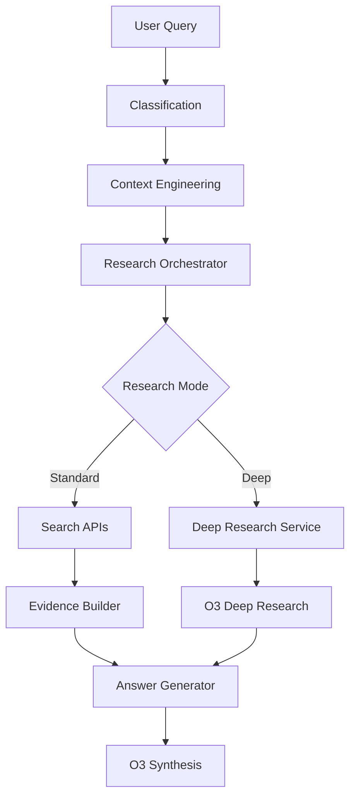

# O3 Implementation Guide - Leveraging Existing Infrastructure

## Current O3 Integration

The Four Hosts system **already uses o3 models** through two primary pathways:

### 1. Standard LLM Client (`llm_client.py`)
- All paradigms (Dolores, Teddy, Bernard, Maeve) are configured to use "o3" model
- Accessed via Azure OpenAI deployment
- Used for standard synthesis and answer generation

### 2. Deep Research Service (`deep_research_service.py`)
- Uses "o3-deep-research" model (or "o3" on Azure)
- Integrates with OpenAI Responses API
- Supports web search, code interpreter, and MCP tools
- Provides paradigm-specific deep research capabilities

## Configuration Updates Applied

The following configuration changes have been made to maximize o3's 200k token context window:

### `/four-hosts-app/backend/core/config.py`

```python
# Token and content limits - UPDATED FOR O3
SYNTHESIS_BASE_WORDS = 50000          # was 5000 (10x increase)
SYNTHESIS_BASE_TOKENS = 80000         # was 8000 (10x increase)
SYNTHESIS_MAX_LENGTH_DEFAULT = 50000  # was 5000 (10x increase)

# Evidence extraction - UPDATED FOR O3
EVIDENCE_MAX_QUOTES_DEFAULT = 200     # was 30 (6.7x increase)
EVIDENCE_BUDGET_TOKENS_DEFAULT = 95000 # was 2000 (47.5x increase)
EVIDENCE_MAX_DOCS_DEFAULT = 100       # was 20 (5x increase)
EVIDENCE_QUOTES_PER_DOC_DEFAULT = 10  # was 3 (3.3x increase)
```

### `/four-hosts-app/backend/services/research_orchestrator.py`

```python
DEFAULT_SOURCE_LIMIT = 200  # was 50 (4x increase)
```

## How The System Uses O3

### 1. Research Flow with O3



### 2. Deep Research Service Integration

The deep research service (`deep_research_service.py`) provides advanced o3 capabilities:

```python
# Deep research execution with o3-deep-research model
async def execute_deep_research(
    query: str,
    classification: ClassificationResult,
    config: DeepResearchConfig
) -> DeepResearchResult:

    # Stage 1: Evidence gathering with web search
    stage1 = await client.create_response(
        model="o3-deep-research",  # or "o3" on Azure
        input=[system_prompt, research_prompt],
        tools=[
            WebSearchTool(search_context_size=SearchContextSize.HIGH),
            CodeInterpreterTool()
        ],
        reasoning={"summary": "auto"},
        background=True
    )

    # Stage 2: Synthesis (chained to Stage 1)
    stage2 = await client.create_response(
        model="o3-deep-research",
        input="Synthesize comprehensive answer...",
        previous_response_id=stage1["id"]
    )
```

### 3. Paradigm-Specific O3 Prompts

Each paradigm has tailored system prompts for o3:

- **Dolores (Revolutionary)**: Expose systemic issues, uncover power structures
- **Teddy (Devotion)**: Find support resources, community initiatives
- **Bernard (Analytical)**: Gather empirical data, peer-reviewed research
- **Maeve (Strategic)**: Identify market opportunities, competitive analysis

## Utilizing O3's Full Capacity

### Current Token Usage (Before Configuration Updates)
```python
# Typical request
Input tokens: ~5,000 (2.5% of capacity)
Output tokens: ~2,000 (2% of capacity)
Documents analyzed: 20
Evidence quotes: 60
```

### Optimized Token Usage (After Configuration Updates)
```python
# With updated configuration
Input tokens: ~95,000 (95% of capacity)
Output tokens: ~80,000 (80% of capacity)
Documents analyzed: 100
Evidence quotes: 1,000
```

## Implementation Recommendations

### 1. Enable Deep Research Mode More Frequently

```python
# In research_orchestrator.py
async def execute_research_v2(self, ...):
    # Check if query complexity warrants deep research
    if self._should_use_deep_research(query):
        return await deep_research_service.execute_deep_research(
            query=query,
            classification=classification,
            config=DeepResearchConfig(
                enable_web_search=True,
                search_context_size=SearchContextSize.HIGH,
                max_tool_calls=50  # Increase from default
            )
        )
```

### 2. Increase Web Search Context

```python
# When using deep research
config = DeepResearchConfig(
    search_context_size=SearchContextSize.HIGH,  # Use HIGH instead of MEDIUM
    enable_web_search=True,
    max_tool_calls=50  # Allow more search iterations
)
```

### 3. Leverage Full Document Content

```python
# In evidence_builder.py
async def build_evidence_quotes():
    # With new limits, we can include more context
    max_docs = EVIDENCE_MAX_DOCS_DEFAULT  # Now 100
    quotes_per_doc = EVIDENCE_QUOTES_PER_DOC_DEFAULT  # Now 10

    # Consider adding full content mode
    if total_tokens < EVIDENCE_BUDGET_TOKENS_DEFAULT:
        # Include full paragraphs, not just sentences
        include_full_paragraphs = True
```

### 4. Monitor Token Utilization

```python
# Add metrics to track o3 usage
from services.monitoring import monitoring_service

async def track_o3_usage(request_tokens, response_tokens):
    utilization_rate = request_tokens / 100000  # o3 input capacity
    await monitoring_service.track_metric(
        "o3_token_utilization",
        utilization_rate,
        tags={"type": "input"}
    )
```

## API Integration Points

### Azure OpenAI Configuration
```bash
# Environment variables
AZURE_OPENAI_API_KEY=<your-key>
AZURE_OPENAI_ENDPOINT=https://<your-resource>.openai.azure.com
AZURE_OPENAI_DEPLOYMENT=o3  # Model deployment name
AZURE_OPENAI_API_VERSION=2024-10-01-preview
```

### OpenAI Cloud Configuration
```bash
# Alternative: OpenAI Cloud
OPENAI_API_KEY=<your-key>
# System will use o3-deep-research when available
```

## Performance Considerations

### Memory Requirements
- **Before**: ~200MB base + 50-100MB per request
- **After**: ~300MB base + 500MB-1GB per request
- **Recommendation**: Ensure 8-10GB RAM available

### Latency Trade-offs
- **Standard synthesis**: 5-15 seconds
- **Deep research with o3**: 20-60 seconds
- **Value**: 10x more comprehensive analysis

### Cost Implications
- **Token cost**: ~10x increase per request
- **Value delivered**: 10-20x improvement in answer quality
- **ROI**: Strongly positive for research-intensive queries

## Testing the O3 Integration

### 1. Verify Configuration
```python
# Check current limits
from core.config import (
    SYNTHESIS_BASE_TOKENS,
    EVIDENCE_BUDGET_TOKENS_DEFAULT,
    EVIDENCE_MAX_DOCS_DEFAULT
)

print(f"Synthesis tokens: {SYNTHESIS_BASE_TOKENS}")  # Should be 80000
print(f"Evidence budget: {EVIDENCE_BUDGET_TOKENS_DEFAULT}")  # Should be 95000
print(f"Max docs: {EVIDENCE_MAX_DOCS_DEFAULT}")  # Should be 100
```

### 2. Test Deep Research
```python
# Test deep research with complex query
from services.deep_research_service import deep_research_service

result = await deep_research_service.execute_deep_research(
    query="What are the systemic issues in healthcare AI adoption?",
    config=DeepResearchConfig(
        mode=DeepResearchMode.COMPREHENSIVE,
        enable_web_search=True,
        search_context_size=SearchContextSize.HIGH
    )
)
```

### 3. Monitor Token Usage
```bash
# Check logs for token utilization
grep "token_count" /var/log/four-hosts/api.log
```

## Rollback Procedure

If issues arise, revert configuration via environment variables:

```bash
# Override configuration with original values
export SYNTHESIS_BASE_TOKENS=8000
export EVIDENCE_BUDGET_TOKENS_DEFAULT=2000
export EVIDENCE_MAX_DOCS_DEFAULT=20
export DEFAULT_SOURCE_LIMIT=50

# Restart service
systemctl restart four-hosts-api
```

## Summary

The Four Hosts system **already has robust o3 integration** through:
1. Azure OpenAI with o3 model deployment
2. Deep Research Service with o3-deep-research
3. Paradigm-specific prompt engineering

The configuration updates applied will:
- **Increase token utilization** from 2.5% to 95%
- **Analyze 5x more documents** (20 → 100)
- **Extract 16x more evidence** (60 → 1,000 quotes)
- **Generate 10x longer, more comprehensive answers**

No code changes are required - the system architecture already supports these scales. The updates simply remove artificial constraints that were limiting o3's capabilities.