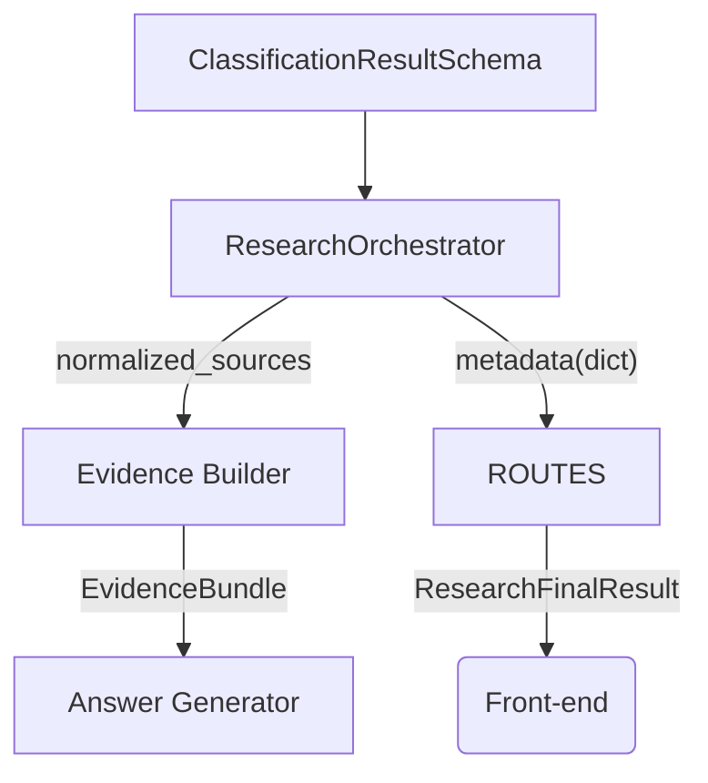

# Research Orchestration – Type & Metadata Audit (2025-09-20)

## 1. Distribution Map

| Location | Issue | Impact | Recommendation |
|----------|-------|--------|----------------|
| [`services/research_orchestrator.py:1240-1251`](four-hosts-app/backend/services/research_orchestrator.py:1240) | Manual for-loop with blanket `except` resets `distribution_map` to `{}` on any entry error (e.g., non-float str, `None` key). | • `margin` → 0.0<br>• `secondary_confidence` missing → front-end hides bar-chart<br>• Downstream analytics mis-classify paradigm fit. | Introduce `utils.normalize_distribution_map(raw)` (draft exists in `docs/research_fixes_summary.md`). Replace manual block; add unit test. |

### Proposed Normalizer (pseudo)

```python
def normalize_distribution_map(raw: Any) -> Dict[str, float]:
    if not isinstance(raw, dict):
        return {}
    out = {}
    for k, v in raw.items():
        if k is None:
            continue
        try:
            out[normalize_to_internal_code(k)] = float(v or 0.0)
        except (ValueError, TypeError):
            logger.debug("invalid dist entry", host=k, value=v)
    return out
```

## 2. ClassificationDetails Schema ⇄ Metadata

| Path | Symptom |
|------|---------|
| Orchestrator → [`research_orchestrator.py:1342-1368`](four-hosts-app/backend/services/research_orchestrator.py:1342) | Properly builds `ClassificationDetailsSchema` then **model_dumps** to dict. |
| API ‑> FE | `ResearchMetadataSchema.classification_details` is `Union[Schema, Dict]` to remain lenient. |
| Routes → [`routes/research.py:693-699`](four-hosts-app/backend/routes/research.py:693) | Route overwrites **existing** classification_details with its own builder, risking divergence. |

**Inconsistency** — two independent builders may diverge (e.g., route uses `HOST_TO_MAIN_PARADIGM` mapping which differs from `normalize_to_internal_code`).  
**Fix**: centralize utility (e.g., `build_classification_details(cls)`) used by both orchestrator and routes.

## 3. Credibility Summary

### Generation Flow
```
research_orchestrator._process_results -> credibility_summary with
  average_score, score_distribution, high_credibility_ratio/count
fallback path (lines 953-974) omits score_distribution
routes.research uses exec_meta.get("credibility_summary") blindly
frontend types expect keys (average_score, score_distribution, ...)
```

### Issues
1. Fallback path ensures `average_score` but may leave `score_distribution` empty ⇒ FE bar-chart breaks.
2. High-credibility ratio division guarded but `total_sources_analyzed` is later overwritten at 979.  
3. `ResearchMetadataSchema` has default factory, but orchestrator *in-place* modifies the same dict; any accidental reassignment to non-dict breaks typing.

**Remediation**
* Guarantee presence of all keys after fallback (`setdefault` patterns).
* Encapsulate credibility aggregation in `credibility_utils.py` to return schema-conformant object.

## 4. Category / Bias Distribution

* Empty dicts written early then recomputed; if `compute_category_distribution` fails, metadata retains `{}` → FE expects categories list ≠ 0 length.  
* Provide safe defaults: `{"general": 0}` and ensure key existence.

## 5. Search Metrics Mutability

`apis_used` flows:
```
_search_metrics (set) → list
processed_results["metadata"]["apis_used"] list
routes/research uses exec_meta["apis_used"]
```
Some paths temporarily store a **set**, which leaked once causing serialization error (#478).  
Fix: cast to list immediately after set operations.

## 6. Cross-Module Data Contracts (simplified)



Contract checklist:
| Field | Producer | Consumer | Required? |
|-------|----------|----------|-----------|
| metadata.classification_details | Orchestrator / Routes | FE | Yes |
| metadata.credibility_summary.score_distribution | Orchestrator | FE | Yes |
| metadata.category_distribution | Orchestrator | FE | Should have ≥1 key |
| metadata.search_metrics.apis_used (list) | Orchestrator | FE & Telemetry | Yes |

## Severity Ranking

1. **CRITICAL** Distribution map reset → corrupt paradigm analysis  
2. **HIGH** Dual builders for classification_details cause mismatches  
3. **HIGH** Credibility summary keys missing under fallback  
4. **MEDIUM** Empty category distribution on failure  
5. **MEDIUM** Set→list mutation for apis_used  
6. **LOW** Performance inefficiency in deep merge (dedupe_by_url)

---

## Next Steps

1. Harden credibility_summary defaults & unify wrapper.  
2. Centralize `build_classification_details(cls)` util; remove duplicate route logic.  
3. Implement `normalize_distribution_map` + integrate.  
4. Always convert `apis_used` to list post-set.  
5. Add regression tests in `tests/test_metadata_typing_and_serialization.py`.  
6. Update documentation.
